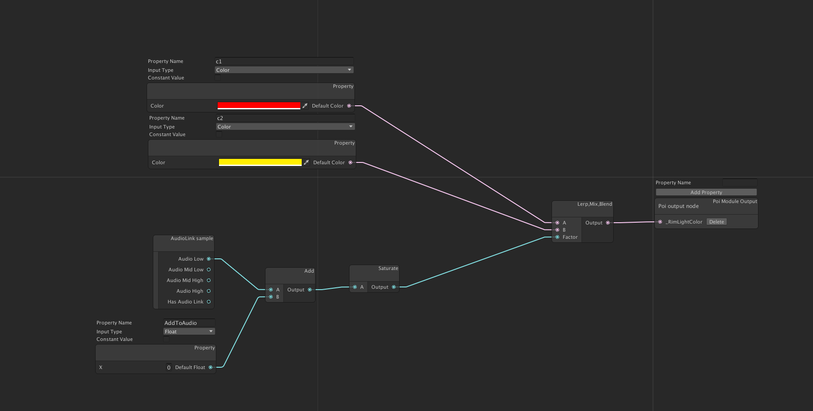
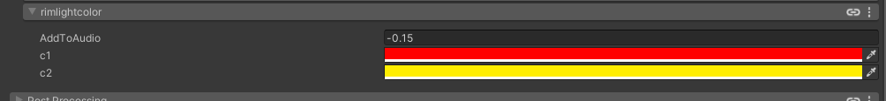
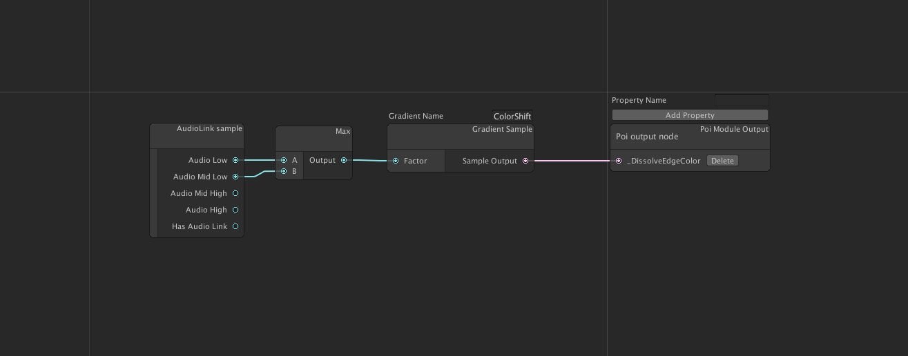
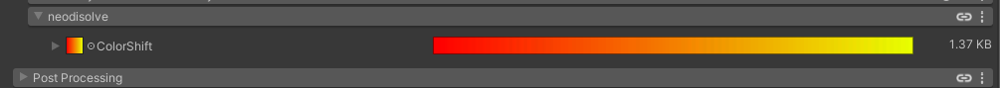
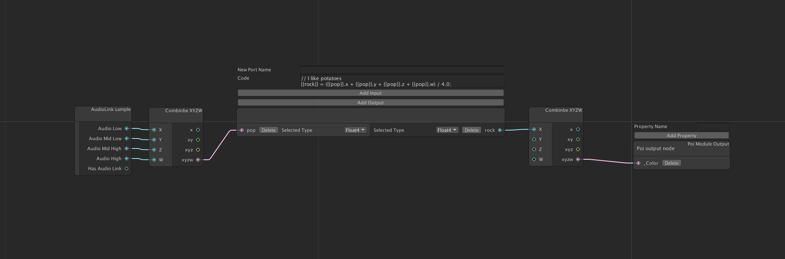
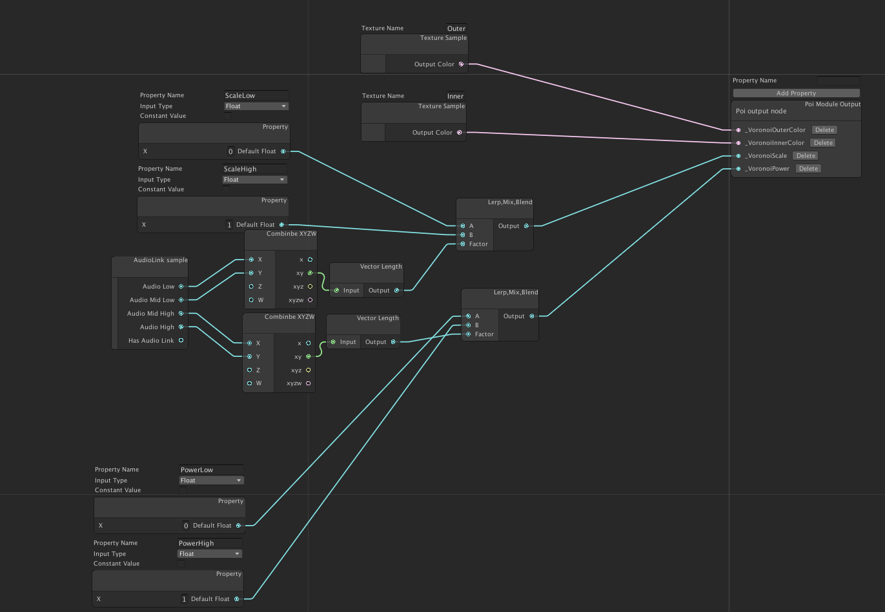
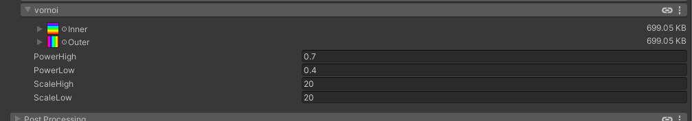
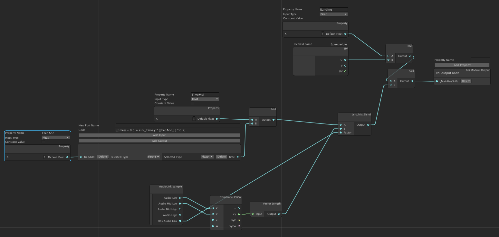
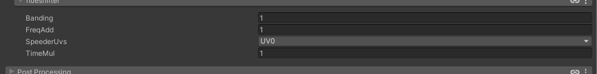

#Examples

Below is a breakdown of some of the examples in the package. Feel free to open the images into a new tab to get a better look.

## Rim Light Color
The following example graph audio links the rim light color between 2 values

In this example we are defining 2 color properties, red and yellow, that will
be mixed/lerped between based on audio link. There is an additional term in the
lower left that adds to the value to get the default state of the music in the
demo closer to the crossover for visual interest.

As we can see the properties panel provides easy access to those values.

Node that this example could have just as easily worked on any given color
value in the shader, but rim light color was chosen as it is not possible to
audio link it today.

## Disolve color

This example shows using a gradient texture sampling.

In this example we are using the max of the lower channels in audio link to
sample a gradient texture. This enables us to change the rate of change and
colors that will be used in the shader easily without rebuilding anything.
Clicking on the large image bar will open up the gradient editor that comes
with Poiyomi. Of note is that the textures may not be stored where you expect
with his tool so be sure to move them to an appropriate directory.

## Raw Text

This example has no properties, but it shows how to use the raw text node.
This node allows you in input raw shader code that will be inserted into the
module and integrate with the rest of the node based system. 

If you look closely you will see `{{rock}}` and `{{pop}}`. These strings will
be replaced with appropriately name mangled versions when the module is built.
Using `rock` or `pop` without the double brackets would have resulted in a
compiler error. Semi-colons are also required at the ends of lines.

## Voronoi

We have quite a bit going on here. We are assigning the Outer Voronoi nodes to a
color we sample from a texture, and we are audio linking the Scale and Power
values for the Voronoi section. 
This showcases the ability to operate on many values at once in a single modules.

## Hue Shifting

This example showcases some dynamic decisions not normally available. Here we
have the hue shift amount acting different under audio link and non audio link
situations. To properly see this one you will need to enable and disable the
audio link provider in your scene. Without audio link the rainbow caused by hue
shifting slowly moves up and down the capsule. With audio link it stops moving
at idle and is instead driven by the low's in the song. 
This leads to an interesting effect when there is no audio link and a different
one that is obviously driven by audio when it is possible.

