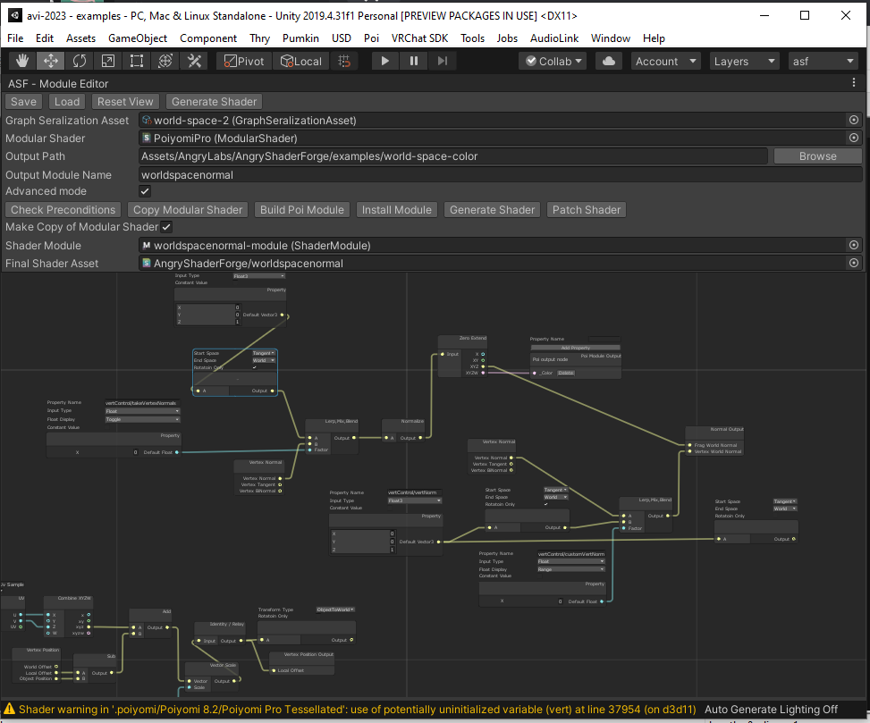

#UI Overview

This is the UI for the graph module editor.

The editor is broken into 2 main parts. 
The control panel at the top and the graph at the bottom.

## Control Panel
The control panel is a list of important configuration for the module as a whole.
This control can be further broke down into two main components. 
The base controls and the advanced controls.

### Base Controls

#### Graph Seralization Asset
This is your current AngrySF module that you are editing. 
Changing this will replace the graph and many other fields to match this AngrySF file.

#### Modular Shader
This is the shader that your module will be installed into.
While modules don't need to be tied to a shader to exist the AngrySF system requires 
post processing of the Poiyomi shader after the module has been installed. 
This field ensures that it can be handled automatically.

#### Output Path
This is the path that your module and its supporting files will be written to when they are generated.

#### Output Module Name
This is the name of the module that you are generating.  Note that this field
automatically filters some letters and symbols from it as it is used in some
contexts where that is required.

## Graph

For documentation of each node visit the [Node documentation](../nodes/)

This is the main control that you will build your module in.

## Controling / Hotkeys

### Left Click
Selects nodes. You can drag for further selection.

### Right Click
Opens the context menu.

### Copy/Paste
Control-C and Control-V will copy and paste the current selection.

### Spacebar
Opens the node add window directly.

