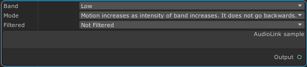

##Compare Nodes

### Max / Min

Returns the smaller or larger of the inputs. Each component of the input is
operated on separately.

### Lerp/Mix/Blend

<h2>High detail lerp docs <a href="/nodes/lerp">Here</a></h2>

Lerp between A and B inputs.

Lerp is a linear interpolation between the first 2 elements. 
This node is excellent for smoothly picking between values in a range,
or selecting one of 2 inputs.

See the link above for a detailed breakdown of exactly how this node works.

### Step

If b > a return 1. Otherwise return 0.

### SmoothStep

If X < Edge 1 return Edge 1.  
If X > Edge 2 return Edge 2.  
Otherwise return a smoothly changing value between the two edges.

### Greater Than &  Less Than 

Returns 1 if the condition is met. 0 otherwise. 

## Math Nodes

### Vector Length

Get the [Euclidean](https://en.wikipedia.org/wiki/Euclidean_distance) length of
the vector using the same logic found in the
[Pythagorean theorem.](https://en.wikipedia.org/wiki/Pythagorean_theorem)

### Add / Subtract / Multiply / Divide

These math nodes preform basic math on their inputs. 
The ports are always the same type and each operation takes place independently 
on the components of the inputs.

### Trivial Math functions
These take in one value and output one value. They all operate component wise
meaning that x,y,z, and w are all operated on independently. To save space these nodes won't get an image.

- Absolute Value: Multiply negative values by -1 to make them positive
- Ceiling: Find the next largest integer for a non integer value. For instance 1.4 becomes 2. -1.4 becomes -1
- Exponential2: raise 2 to the Nth power where N is the input value.
- Exponential: raise e (approximately 2.718281) to the Nth power where N is the input value.
- Floor: Find the next smallest integer for a non integer value. For instance 1.4 becomes 1. -1.4 becomes -2
- Fraction: Discard the non fractional part of a value. 2.4 becomes 0.4
- LogrithmBase10: Returns the Log base 10 of the input value
- LogrithmBase2: Returns the Log base 2 of the input value
- NaturalLogarithm: Returns the Log base e (approximately 2.718281) of the input value
- Round: Round the input to the nearest whole number. 1.4 becomes 1. Note that
  for values exceptionally close to 0.5 you should look into rounding modes and
  understand that graphics cards are not always perfectly accurate in their
  math. [Rounding Wikipedia](https://en.wikipedia.org/wiki/Rounding) 
- Saturate: Clamps the values between 0 and 1.0
- Truncate: Discard the fractional part of a number. You can think of this as rounding toward zero

### One Minus

This node subtracts 1 from each component of the input. Think of this as 1.0 - Input

### Vector Scale

This multiplies the vector by the input scale equally in all directions.

## Misc

### HSV To RGB

### RGB To HSV

Convert between (Hue Saturation Value Alpha) and (Red Green Blue Alpha)

### Combine XYZW

Combine several nodes into one value. Missing Values will be replaced with 0.

### Zero Extend

Extend the input to contain more values. Missing values will be replaced with
0

### Split

This node splits a multi component input into parts. The outputs dynamically change to match the available 
ones in the input.

### Raw Text

This node allows raw shader code to be injected.  

The top section allows you to add inputs and outputs. These values will be
initialized before your code runs. The next section is a multi line text box
that allows you to enter your own code. Instead of using the variables you
requested wrap them in braces like `{{this}}`. This will cause your variables
to have their names mangled to match the values actually present in the shader.

In the example above the value Bang is replaced with Clang.xyxy.

Note that when this is used with the Preview Node you will often have a broken
shader while you are typing. This is to be expected and the shader is
recreated every time you update the text.

### Identity/Relay

This node has no meaning to the generated shader. 
It allows for better routing and organization of the node tree.

#Input
## Time

Returns the number of seconds since the world loaded. This is not synced.

## Property

Allows creating a property that can be edited in your modules section of the
material properties.  If checked the `Is Constant` checkbox will cause the
value to be used directly and it will not be available for editing in the inspector. 

The type of property can be selected from the dropdown. The name used in the
material properties can be found and edited in the upper text box.

### Property Drawers

You can use property names with one or more `/`'s in them to create folders in the output property as can be seen in the examples below. 

### Float Range

A special case UI is available for the float property type. If you enable `Use
Float Range` you will be able to set a range for the node and get a slider in
your shader. This can be seen in the image above.

## Texture - Poiyomi controls

Create a new texture that is configured like it would be if it was a built in
Poiyomi texture.

## UV Texture Sample

This samples a texture that is sampled by the provided UVs.

## AudioLink Simple Sample

Sample the AudioLink intensity for individual bands at a particular point in time.
Has Audio Link is 1 if audio link is active at the moment.

## AudioLink Chrono

Sample the AudioLink Chrono values. The output acts roughly like time modified in the ways that the dropdowns suggest.

## Gradient

Create a new texture to act as a gradient including the Poiyomi built in
gradient editor. 

## UVLogic

Sample UVS. This provides an interface like you would expect to find on a texture.

## Global Mask

This node provides access to the global masks you are use to in Poi.
While there isn't much to see in the node editor the inspector uses the same
dropdown that you can find in many other places in the shader.

<h3><b><u>Note that this node is not currently compatiable with the Preview Node</u></b></h3>

## Read Property

Just as the Poi Output node allows you to write properties this node enables
you to read from them. This when used with the global mask node enables you to
disable your node for certain parts of the mesh.

<h3><b><u>Note that this node is not currently compatible with the Preview Node</u></b></h3>

## Camera Distance / Proximity

This node provides the distance a pixel is from the camera.

The world output is in world space.  
The object output is in local space to the object and it is effected by object scale.

<h3><b><u>Note that this node is not currently compatible with the Preview Node</u></b></h3>

## Vertex Normal

This node enables both the fragment and vertex stage to access the vertex
normal data.

The nodes provide normal, tangent, and the bi-normal (cross product of normal and tangent).

## Vertex Position

This node enables access to the vertex position and offsets.

Local Offset is the extra offset applied by the shader.

Object Position is the offset when compared to the origin of the object.

World Position is as expected the offset from the world origin.

#Trig

## Sine / Cosine / Tangent

Each of these functions takes one input in radians and returns a value
according to normal trig rules.

## ArcSine / ArcCosine / ArcTangent

Each of these functions takes one input and returns a value
according to normal trig rules.

## ATan2

This is a specialized version of Arc Tangent that takes 2 values and can
determine which angle the value belongs to. The normal Arc Tangent can't
determine a difference between 45 and 135 degrees for instance. This can give
the confusing results in those cases, but `atan2` uses the fact that it gets 2
values in to differentiate these cases.

## ToDegrees / ToRadians

Convert values between degrees and radians depending on the node selected

#Output

## PoiModuleOutput

This is a special node that you can not delete or copy.

This node is used to interact with the larger Poiyomi shader and set values
used elsewhere in the shader. 

## Normal Output

This node enables you to edit the normals for both the vertex stage and the
fragment stage. These do not combine with the existing normals and instead
override them. Use the Normal Input node if you want to combine with them.

As suggested by the names both the Frag and Vertex normals are in world space.

## Vertex Position Output

This node lets you set the local offset (in object space) for the node.
Combine this with the vertex position input node of you want to keep
pre-existing transforms.

### Preview

This node allows for viewing of previews of parts of the shader to help
visualize the logic.  To use it plug any node in to its input. Float nodes will
be shown in black and white. Vector2 and Vector3 nodes will be shown by
replacing RGB with their corresponding XYZ values.
The alpha channel for Vector4s are set to fully opaque to make it
possible to view the preview.

The preview node can not handle the ReadProperty , Global Mask, or Camera
Distance node. Using them in a will result in an error and either the shader
being pink or not generating at all. 

To get audio link working with this node you will need to be in play mode.
Updates to the module often break AudioLink. Toggling the Audio Link source in
unity on and off resolves the issue.

The Debug Panel is for internal use and will change in the future, but you may find it helpful.

