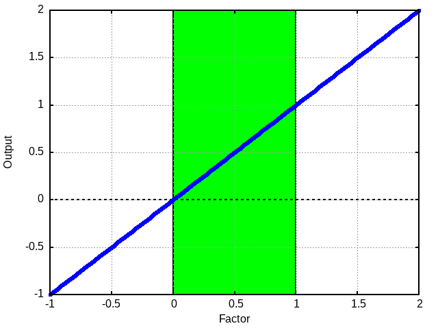
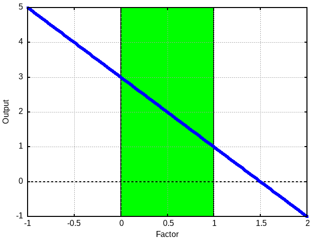

This is the lerp node. As indiciated by it's title you may want to think about
it as the Mix or Blend node from other software.

While the examples given below are only for single values each element in a
vector (such as a float4 that is used for color data) is operated on
independently.

This node mixes the values between the low and high value assuming the input to
`Factor` is between 0 and 1. 

# Simple Examples

Above you can see an example of the outputs of Lerp where the low was 0 and the
high is 1.  Notice the green area. This denotes the area where the factor is
between 0 and 1. Also notice that the output follows a line that continues
outside of the given range. This is not an error. 

You should either consider how to handle factor values that are out of the
normal bounds or send them through a saturate to keep them in the "normal"
bounds.

Let's see another one.

In this one we are lerping from 3 to 1. Notice that the high value is less than
the low value. This is fine. That just means lareger factors get us a smaller
value. As we can see this line also continues out of the normal bounds.

